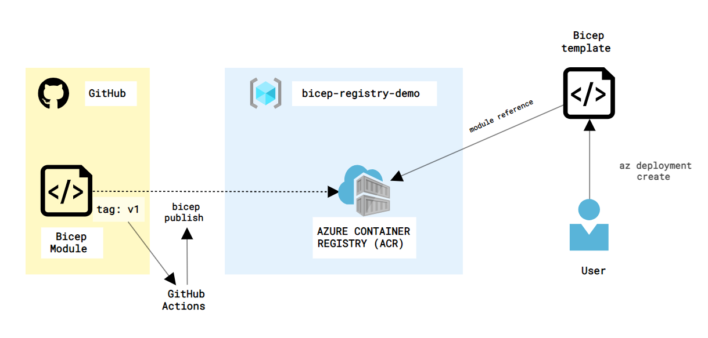

# Bicep Registry Demo

[](https://github.com/matsest/bicep-registry-demo/actions/workflows/bicep-publish.yml)

This repo contains code to publish a [Bicep module](https://docs.microsoft.com/en-us/azure/azure-resource-manager/bicep/modules) to a [Private Module Registry](https://docs.microsoft.com/en-us/azure/azure-resource-manager/bicep/private-module-registry).

## Description

This demo will publish modules under the [modules path](./modules) to a Bicep registry as defined in [bicepconfig.json](./bicepconfig.json). This is done using a [GitHub Actions workflow](./.github/workflows/bicep-publish.yml) and a [lightweight wrapper script](./.github/publish-modules.sh).

You will then be able to deploy a template that refers to this module from the registry :muscle:



## Prerequisites

- [Azure CLI](https://docs.microsoft.com/en-us/cli/azure/install-azure-cli)
- Bicep (install with `az bicep install` - you will need `v0.4.1008` or newer)
- An Azure subscription with Owner permissions
- Permission to create a service principal in Azure AD

## Usage

### 1. Fork the repo

1. Fork this repo by clicking **Fork** in the top-right corner

### 2. Create an Azure Container Registry instance with Azure CLI

1. Create a resource group

```bash
az group create -n bicep-registry-demo -l westeurope
```

2. Create an Azure Container Registry

```bash
az acr create -g bicep-registry-demo -l westeurope -n <registry name> --sku basic
```

> :exclamation: Make note of the registry name you choose. This name must be globally unique.

### 3. Set up your GitHub repo

1. Add your registry to [bicepconfig.json](./bicepconfig.json)
   -  Change the `registryName` to the unique name from the step above. The value should be `<registry name>.azurecr.io`.
   - Learn more about the Bicep configuration file [here](https://docs.microsoft.com/en-us/azure/azure-resource-manager/bicep/bicep-config).

2. Create service principal with [AcrPush permissions](https://docs.microsoft.com/en-us/azure/container-registry/container-registry-roles?tabs=azure-cli) to the container registry, and [add a secret](https://docs.github.com/en/actions/security-guides/encrypted-secrets#creating-encrypted-secrets-for-a-repository) to your GitHub repository

<details>

```bash
# Get the id of your ACR
SCOPE=$(az acr show -n <registry name> -g <resource group> --query id -o tsv)
#! Replace the values for registry name and resource group

az ad sp create-for-rbac --name "bicep-registry-demo-ci" --role AcrPush \
                         --scopes $SCOPE --sdk-auth

# The command should output a JSON object similar to this:
{
  "clientId": "<GUID>",
  "clientSecret": "<GUID>",
  "subscriptionId": "<GUID>",
  "tenantId": "<GUID>",
  (...)
}

# Copy this and add as a repository secret named AZURE_CREDENTIALS
```

</details>

### 4. Publish a module using GitHub Actions

1. Modify the template in modules/storage/main.bicep.
   - Example: Update the `location` parameter to restrict allowed values

```bicep
@allowed([
  'northeurope'
  'westeurope'
])
param location string = 'westeurope'
```

2. Commit, tag and push changes

```bash
git add modules/storage/main.bicep
git commit -m "set allowed locations"
git tag v1.1.0
git push # push the commit
git push --tags # push the commit with tags
```

This will trigger the [bicep-publish workflow](./.github/workflows/bicep-publish.yml) and publish the module to the registry.

> :exclamation: Note that each new tag pushed will trigger a new published version.

To see the published modules in the registry see [this](https://docs.microsoft.com/en-us/azure/azure-resource-manager/bicep/private-module-registry#view-files-in-registry).

### 4. Deploy template using module from registry with Azure CLI

There is a demo template in [demo/main.bicep](./demo/main.bicep) which uses the module from the registry:

```bicep
module storage 'br/demoRegistry:storage:v1.1.0' = {
    ...
}
```

Note that this module refers to version `v1.1.0`. If you have published another version than this, please update the value in the template.

1. Deploy the template by running the following command:

```bash
az deployment group create -n registry-demo -g bicep-registry-demo -f ./demo/main.bicep
```

:heavy_check_mark: **Congratulations!** - you've successfully deployed a Bicep template that refers to a remote module in a private module registry!

### Next steps

To build upon this you can try:
- Adding another module in the modules directory. The name of the directory will be the module name and it must have a `main.bicep` file within it.
- Consuming the module from the registry in a another workflow to deploy resources
  - You will need to set up a service principal that have [AcrPull permissions](https://docs.microsoft.com/en-us/azure/container-registry/container-registry-roles?tabs=azure-cli) and permissions to deploy resources (Contributor or equivalent)
- Add more robust versioning automation (e.g. always publish a `latest` version on push to main) and use [GitHub Releases](https://docs.github.com/en/actions/learn-github-actions/events-that-trigger-workflows#release) to publish specific versions

### Cleanup

Delete the resource group and the resources in in by running:

```bash
az group delete -n bicep-registry-demo
```

## Learn more

- [Bicep on Microsoft Learn](https://docs.microsoft.com/en-us/azure/azure-resource-manager/bicep/learn-bicep)
- [Bicep overview](https://docs.microsoft.com/en-us/azure/azure-resource-manager/bicep/overview)
- [Bicep modules](https://docs.microsoft.com/en-us/azure/azure-resource-manager/bicep/modules)
- [Bicep module registry](https://docs.microsoft.com/en-us/azure/azure-resource-manager/bicep/private-module-registry)